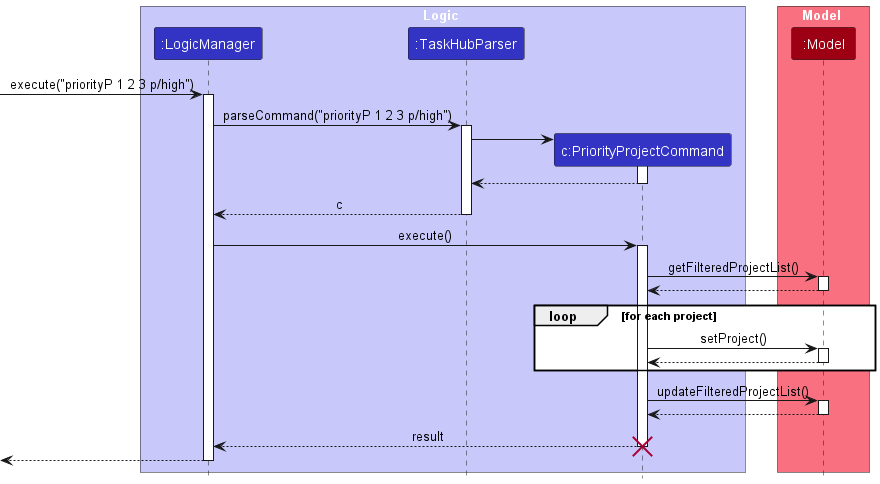
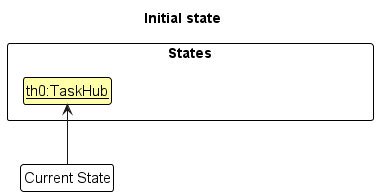
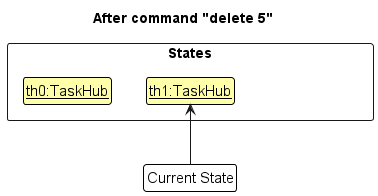
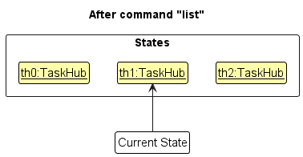

* Table of Contents
{:toc}

--------------------------------------------------------------------------------------------------------------------

## **Acknowledgements**

* {list here sources of all reused/adapted ideas, code, documentation, and third-party libraries -- include links to the original source as well}

--------------------------------------------------------------------------------------------------------------------

## **Setting up, getting started**

Refer to the guide [_Setting up and getting started_](SettingUp.md).

--------------------------------------------------------------------------------------------------------------------

## **Design**

:bulb: **Tip:** The `.puml` files used to create diagrams in this document `docs/diagrams` folder. Refer to the [_PlantUML Tutorial_ at se-edu/guides](https://se-education.org/guides/tutorials/plantUml.html) to learn how to create and edit diagrams.

### Architecture

The ***Architecture Diagram*** given above explains the high-level design of the App.

Given below is a quick overview of main components and how they interact with each other.

**Main components of the architecture**

**`Main`** (consisting of classes [`Main`](https://github.com/se-edu/addressbook-level3/tree/master/src/main/java/seedu/address/Main.java) and [`MainApp`](https://github.com/se-edu/addressbook-level3/tree/master/src/main/java/seedu/address/MainApp.java)) is in charge of the app launch and shut down.
* At app launch, it initializes the other components in the correct sequence, and connects them up with each other.
* At shut down, it shuts down the other components and invokes cleanup methods where necessary.

The bulk of the app's work is done by the following four components:

* [**`UI`**](#ui-component): The UI of the App.
* [**`Logic`**](#logic-component): The command executor.
* [**`Model`**](#model-component): Holds the data of the App in memory.
* [**`Storage`**](#storage-component): Reads data from, and writes data to, the hard disk.

[**`Commons`**](#common-classes) represents a collection of classes used by multiple other components.

**How the architecture components interact with each other**

The *Sequence Diagram* below shows how the components interact with each other for the scenario where the user issues the command `deleteE 1`.

Each of the four main components (also shown in the diagram above),

* defines its *API* in an `interface` with the same name as the Component.
* implements its functionality using a concrete `{Component Name}Manager` class (which follows the corresponding API `interface` mentioned in the previous point.

For example, the `Logic` component defines its API in the `Logic.java` interface and implements its functionality using the `LogicManager.java` class which follows the `Logic` interface. Other components interact with a given component through its interface rather than the concrete class (reason: to prevent outside component's being coupled to the implementation of a component), as illustrated in the (partial) class diagram below.

The sections below give more details of each component.

### UI component

The **API** of this component is specified in [`Ui.java`](https://github.com/se-edu/addressbook-level3/tree/master/src/main/java/seedu/address/ui/Ui.java)

The UI consists of a `MainWindow` that is made up of parts e.g.`CommandBox`, `ResultDisplay`, `EmployeeListPanel`, `StatusBarFooter` etc. All these, including the `MainWindow`, inherit from the abstract `UiPart` class which captures the commonalities between classes that represent parts of the visible GUI.

The `UI` component uses the JavaFx UI framework. The layout of these UI parts are defined in matching `.fxml` files that are in the `src/main/resources/view` folder. For example, the layout of the [`MainWindow`](https://github.com/se-edu/addressbook-level3/tree/master/src/main/java/seedu/address/ui/MainWindow.java) is specified in [`MainWindow.fxml`](https://github.com/se-edu/addressbook-level3/tree/master/src/main/resources/view/MainWindow.fxml)

The `UI` component,

* executes user commands using the `Logic` component.
* listens for changes to `Model` data so that the UI can be updated with the modified data.
* keeps a reference to the `Logic` component, because the `UI` relies on the `Logic` to execute commands.
* depends on some classes in the `Model` component, as it displays `Employee` object residing in the `Model`.

### Logic component

**API** : [`Logic.java`](https://github.com/se-edu/addressbook-level3/tree/master/src/main/java/seedu/address/logic/Logic.java)

Here's a (partial) class diagram of the `Logic` component:

The sequence diagram below illustrates the interactions within the `Logic` component, taking `execute("delete 1")` API call as an example.

:information_source: **Note:** The lifeline for `DeleteCommandParser` should end at the destroy marker (X) but due to a limitation of PlantUML, the lifeline reaches the end of diagram.

How the `Logic` component works:

1. When `Logic` is called upon to execute a command, it is passed to a `TaskHubParser` object which in turn creates a parser that matches the command (e.g., `DeleteCommandParser`) and uses it to parse the command.
2. This results in a `Command` object (more precisely, an object of one of its subclasses e.g., `DeleteCommand`) which is executed by the `LogicManager`.
3. The command can communicate with the `Model` when it is executed (e.g. to delete a employee).
4. The result of the command execution is encapsulated as a `CommandResult` object which is returned back from `Logic`.

Here are the other classes in `Logic` (omitted from the class diagram above) that are used for parsing a user command:

How the parsing works:
* When called upon to parse a user command, the `TaskHubParser` class creates an `XYZCommandParser` (`XYZ` is a placeholder for the specific command name e.g., `AddCommandParser`) which uses the other classes shown above to parse the user command and create a `XYZCommand` object (e.g., `AddCommand`) which the `TaskHubParser` returns back as a `Command` object.
* All `XYZCommandParser` classes (e.g., `AddCommandParser`, `DeleteCommandParser`, ...) inherit from the `Parser` interface so that they can be treated similarly where possible e.g, during testing.

### Model component
**API** : [`Model.java`](https://github.com/se-edu/addressbook-level3/tree/master/src/main/java/seedu/address/model/Model.java)

The `Model` component,

* stores the TaskHub data i.e., all `Employee` and `Project` objects (which are separately contained in a `UniqueEmployeeList` object and a `UniqueProjectList` object).
* stores the currently 'selected' `Employee` and `Project` objects (e.g., results of a search query) as 2 separate _filtered_ list which are exposed to outsiders as an unmodifiable `ObservableList<Employee>` and `ObservableList<Project>` that can be 'observed' e.g. the UI can be bound to this list so that the UI automatically updates when the data in the list change.
* stores a `UserPref` object that represents the user’s preferences. This is exposed to the outside as a `ReadOnlyUserPref` objects.
* does not depend on any of the other three components (as the `Model` represents data entities of the domain, they should make sense on their own without depending on other components)

:information_source: **Note:** An alternative (arguably, a more OOP) model is given below. It has a `Tag` list in the `TaskHub`, which `Employee` references. This allows `TaskHub` to only require one `Tag` object per unique tag, instead of each `Employee` needing their own `Tag` objects. 

### Storage component

**API** : [`Storage.java`](https://github.com/se-edu/addressbook-level3/tree/master/src/main/java/seedu/address/storage/Storage.java)

The `Storage` component,
* can save both TaskHub data and user preference data in JSON format, and read them back into corresponding objects.
* inherits from both `TaskHubStorage` and `UserPrefStorage`, which means it can be treated as either one (if only the functionality of only one is needed).
* depends on some classes in the `Model` component (because the `Storage` component's job is to save/retrieve objects that belong to the `Model`)

### Common classes

Classes used by multiple components are in the `seedu.address.commons` package.

--------------------------------------------------------------------------------------------------------------------

## **Implementation**

This section describes some noteworthy details on how certain features are implemented.

### Add Project feature

When creating a new project from the `addP` command, each `Employee` that is to be added to the `Project` is updated to have an empty `Project`. This is to avoid cyclic dependency between an `Employee` and a `Project`.

Given below is an example usage scenario and the internal changes that happen at each step.

Step 1. The user launches the application. All employees and projects will be shown to the user.

Step 2. The user executes `addP pr/Project1 em/1` to add a new `Project` called `Project1` with the 1st `Employee` on the list as a member. `LogicManager` will call `TaskHubParser#parse(input)` to extract the parameters and pass it to an `AddProjectCommandParser`.

Step 3. `TaskHubParser` will call `AddProjectCommandParser#parse(arguments)` to produce a `AddProjectCommand` to be executed by the `LogicManager`.

Step 4. `LogicManager` calls `AddProjectCommand#execute(model)` to produce a `CommandResult `to be logged. 

Step 5. During the execution of the `AddProjectCommand`, selected `Employee` objects are extracted from the current `UniqueEmployeeList` of `TaskHub` and added to the `Project` in the `AddProjectCommand`. New copies of `Employee` objects are also created to replace the original `Employee` objects in the UniqueEmployeeList using a new `EditCommand`.  

Step 6. A `CommandResult` is produced based on whether the execution was a success or not and returned to the `LogicManager`. 

### Prioritise Projects Feature

Upon creation of a new `Project`, a `ProjectPriority` can be assigned to that `Project` using the `priorityP` command. 

This command modifies the `ProjectPriority` attribute of a `Project` by creating a new `Project` with the updated `ProjectPriority` and replacing the existing `Project` with the updated one.

Currently, only a single project's `ProjectPriority` can be changed at a time.

Given below is an example usage scenario and the internal changes that happen at each step.

Step 1. The user launches the application. All employees and projects will be shown to the user.

Step 2. The user executes `priorityP 1 priority/high` to assign a high priority to the project indexed at 1. `LogicManager` will call `TaskHubParser#parse(input)` to extract the parameters and pass it to an `PriorityProjectCommandParser`.

Step 3. `TaskHubParser` will call `PriorityProjectCommandParser#parse(arguments)` to produce a `PriorityProjectCommand` to be executed by the `LogicManager`.

Step 4. `LogicManager` calls `PriorityProjectCommand#execute(model)` to produce a `CommandResult`.

Step 5. During the execution of the `PriorityProjectCommand`, a new `Project` with the same details as the `Project` which is to have its `ProjectPriority` updated is created but the `ProjectPriority` is now high.

Step 6. The model is updated accordingly through `ModelManager`.

Step 7. A `CommandResult` is produced based on whether the execution was a success or not and returned to the `LogicManager`.

### Find Projects Feature

The displayed list of `Project`s can be filtered by name (specifically, the keywords that the project name contains).

The `findP` command accepts a sequence of keywords (at least 1) and filters the displayed `Project`s accordingly.

Once the `Project`s are filtered out, the displayed list of `Employee`s will also be filtered out, according to whether
they are under at least one of the said filtered `Project`s.

Given below is an example usage scenario and the internal changes that happen at each step.

Step 1. The user launches the application. All employees and projects will be shown to the user.

Step 2. The user executes the `findP website presentation` command to search for projects with name containing "website" and/or "presentation".
`LogicManager` will call `TaskHubParser#parse(input)` to extract the parameters and pass it to an `FindProjectCommandParser`.

Step 3. `TaskHubParser` will call `FindProjectCommandParser#parse(arguments)` to produce a `FindProjectCommand` to be executed by the `LogicManager`.

Step 4. `LogicManager` calls `FindProjectCommand#execute(model)` to produce a `CommandResult`.

Step 5. During the execution of the `FindProjectCommand`, the `ProjectNameContainsKeywordsPredicate` predicate that is received, is
used to update the model's `FilteredProjectList` through `ModelManager`. 

Step 6. Then, using the updated `FilteredProjectList` from step 5, a new `EmployeeUnderFilteredProjectsPredicate` predicate is created. Using this predicate, 
the model's `FilteredEmployeeList` is updated through `ModelManager`.

Step 7. A `CommandResult` is produced based on whether the execution was a success or not and returned to the `LogicManager`.

### \[Proposed\] Mark Project feature

Execution of the `markP` command will result in each `Project` being marked as completed. This is done by setting each `Project`'s `isCompleted` attribute to `true`.

Given below is an example usage scenario and the internal changes that happen at each step.

Step 1. The user launches the application. All employees and projects will be shown to the user.

Step 2. The user executes `markP 1 3` to mark the 1st and 3rd `Project` on the shown list as completed. `LogicManager` will call `TaskHubParser#parse(input)` to extract the parameters and pass it to a `MarkProjectParser`.

Step 3. `TaskHubParser` will call `MarkProjectParser#parse(arguments)` to produce a `MarkProjectCommand` to be executed by the `LogicManager`.

Step 4. `LogicManager` calls `MarkProjectCommand#execute(model)` to produce a `CommandResult `to be logged.

Step 5. During the execution of the `MarkProjectCommand`, a new `Project` object is created for each `Project` to be marked as completed. The new `Project` objects are then used to replace the original `Project` objects in the `UniqueProjectList`.

Step 6. A `CommandResult` is produced based on whether the execution was a success or not and returned to the `LogicManager`.

A similar sequence of events will occur when executing the `unmarkP` command, except that the `isCompleted` attribute of each `Project` will be set to `false` instead of `true`.

### \[Proposed\] Undo/redo feature

#### Proposed Implementation

The proposed undo/redo mechanism is facilitated by `VersionedTaskHub`. It extends `TaskHub` with an undo/redo history, stored internally as an `taskHubStateList` and `currentStatePointer`. Additionally, it implements the following operations:

* `VersionedTaskHub#commit()` — Saves the current TaskHub state in its history.
* `VersionedTaskHub#undo()` — Restores the previous TaskHub state from its history.
* `VersionedTaskHub#redo()` — Restores a previously undone TaskHub state from its history.

These operations are exposed in the `Model` interface as `Model#commitTaskHub()`, `Model#undoTaskHub()` and `Model#redoTaskHub()` respectively.

Given below is an example usage scenario and how the undo/redo mechanism behaves at each step.

Step 1. The user launches the application for the first time. The `VersionedTaskHub` will be initialized with the initial TaskHub state, and the `currentStatePointer` pointing to that single TaskHub state.

Step 2. The user executes `delete 5` command to delete the 5th employee in the TaskHub. The `delete` command calls `Model#commitTaskHub()`, causing the modified state of the TaskHub after the `delete 5` command executes to be saved in the `taskHubStateList`, and the `currentStatePointer` is shifted to the newly inserted TaskHub state.

Step 3. The user executes `add n/David …​` to add a new employee. The `add` command also calls `Model#commitTaskHub()`, causing another modified TaskHub state to be saved into the `taskHubStateList`.

:information_source: **Note:** If a command fails its execution, it will not call `Model#commitTaskHub()`, so the TaskHub state will not be saved into the `taskHubStateList`.

Step 4. The user now decides that adding the employee was a mistake, and decides to undo that action by executing the `undo` command. The `undo` command will call `Model#undoTaskHub()`, which will shift the `currentStatePointer` once to the left, pointing it to the previous TaskHub state, and restores the TaskHub to that state.

:information_source: **Note:** If the `currentStatePointer` is at index 0, pointing to the initial TaskHub state, then there are no previous TaskHub states to restore. The `undo` command uses `Model#canUndoTaskHub()` to check if this is the case. If so, it will return an error to the user rather
than attempting to perform the undo.

The following sequence diagram shows how the undo operation works:

:information_source: **Note:** The lifeline for `UndoCommand` should end at the destroy marker (X) but due to a limitation of PlantUML, the lifeline reaches the end of diagram.

The `redo` command does the opposite — it calls `Model#redoTaskHub()`, which shifts the `currentStatePointer` once to the right, pointing to the previously undone state, and restores the TaskHub to that state.

:information_source: **Note:** If the `currentStatePointer` is at index `taskHubStateList.size() - 1`, pointing to the latest TaskHub state, then there are no undone TaskHub states to restore. The `redo` command uses `Model#canRedoTaskHub()` to check if this is the case. If so, it will return an error to the user rather than attempting to perform the redo.

Step 5. The user then decides to execute the command `list`. Commands that do not modify the TaskHub, such as `list`, will usually not call `Model#commitTaskHub()`, `Model#undoTaskHub()` or `Model#redoTaskHub()`. Thus, the `taskHubStateList` remains unchanged.

Step 6. The user executes `clear`, which calls `Model#commitTaskHub()`. Since the `currentStatePointer` is not pointing at the end of the `taskHubStateList`, all TaskHub states after the `currentStatePointer` will be purged. Reason: It no longer makes sense to redo the `add n/David …​` command. This is the behavior that most modern desktop applications follow.

The following activity diagram summarizes what happens when a user executes a new command:

#### Design considerations:

**Aspect: How undo & redo executes:**

* **Alternative 1 (current choice):** Saves the entire TaskHub.
  * Pros: Easy to implement.
  * Cons: May have performance issues in terms of memory usage.

* **Alternative 2:** Individual command knows how to undo/redo by
  itself.
  * Pros: Will use less memory (e.g. for `delete`, just save the employee being deleted).
  * Cons: We must ensure that the implementation of each individual command are correct.

_{more aspects and alternatives to be added}_

### \[Proposed\] Data archiving

_{Explain here how the data archiving feature will be implemented}_

--------------------------------------------------------------------------------------------------------------------

## **Documentation, logging, testing, configuration, dev-ops**

* [Documentation guide](Documentation.md)
* [Testing guide](Testing.md)
* [Logging guide](Logging.md)
* [Configuration guide](Configuration.md)
* [DevOps guide](DevOps.md)

--------------------------------------------------------------------------------------------------------------------

## **Appendix: Requirements**

### Product scope

**Target user profile**:

* has a need to manage a significant number of employees in a project management context
* has a need to manage projects with multiple timelines
* has a need to quickly delegate and manage distribution of tasks and projects among employees
* prefer desktop apps over other types
* can type fast
* prefers typing to mouse interactions
* is reasonably comfortable using CLI apps

**Value proposition**: manage projects and task delegation faster than a typical mouse/GUI driven app

### User stories

Priorities: High (must have) - `* * *`, Medium (nice to have) - `* *`, Low (unlikely to have) - `*`

| Priority | As a …​                             | I want to …​                  | So that I can…​                                                          |
|----------|-------------------------------------|-------------------------------|--------------------------------------------------------------------------|
| `* * *`  | completely new user                 | see usage instructions        | refer to instructions when I forget how to use the App                   |
| `* * *`  | user                                | add a new employee            | easily manage and access employees in one place                          |
| `* * *`  | user                                | delete an employee            | remove entries that I no longer need                                     |
| `* * *`  | user                                | edit an employee              | change the details of the employee                                       |
| `* * *`  | user                                | list all employees            | see an overview of all the employees                                     |
| `* * *`  | user                                | add a new project             | easily manage and access projects in one place                           |
| `* * *`  | user                                | delete a project              | remove entries that I no longer need                                     |
| `* * *`  | user                                | edit a project                | change the details of the project                                        |
| `* * *`  | user                                | list all projects             | see an overview of all my projects                                       |
| `* * *`  | user                                | find an employee by name      | locate details of employees without having to go through the entire list |
| `* * *`  | user                                | assign employees to a project | know which employees are on which projects in one place                  |
| `* *`    | completely new user                 | have sample data              | practice some commands before trying the App                             |
| `* *`    | user                                | purge all data                | get rid of sample/experimental data and add in my actual data            |
| `*`      | user with many projects in TaskHub  | sort projects by date         | tell which project deadlines are coming soon                             |
| `*`      | user with many employees in Taskhub | sort employees by name          | locate a employee easily                                                   |
| `*`      | new user                            | get autocomplete suggestions  | write commands without referring to usage instructions often             |

*{More to be added}*

### Use cases

(For all use cases below, the **System** is the `TaskHub` and the **Actor** is the `user`, unless specified otherwise)

**Use case 1: Delete a employee**

**MSS**

1.  User requests to list employees
2.  TaskHub shows a list of employees
3.  User requests to delete a specific employee in the list
4.  TaskHub deletes the employee

    Use case ends.

**Extensions**

* 2a. The list is empty.

  Use case ends.

* 3a. The given index is invalid.

    * 3a1. TaskHub shows an error message.

      Use case resumes at step 2.

**Use case 2: Delete a project**

**MSS**

1.  User requests to list projects
2.  TaskHub shows a list of projects
3.  User requests to delete a specific project in the list
4.  TaskHub deletes the employee

    Use case ends.

**Extensions**

* 2a. The list is empty.

  Use case ends.

* 3a. The given index is invalid.

    * 3a1. TaskHub shows an error message.

      Use case resumes at step 2.

**Use case 3: Add an employee**

**MSS**

1. User attempts to add employee
2. TaskHub shows a message that indicates a successful operation

    Use case ends.

**Extensions**
* 1a. The input does not follow the format.
  * 1a1. Taskhub shows an error message with the correct format.

Use case resumes at step 1.

**Use case 4: Add an employee to a project**

**MSS**

1. User attempts to add an employee to a project
2. TaskHub shows a message that indicates a successful operation

   Use case ends.

**Extensions**

* 1a. The Project does not exist.
    * 1a1. The user requests to create a new project with the Employees.
      
        Use case ends.
* 1b. The Employee does not exist.
    * 1b1. The user attempts to add the Employee.(Use Case 3)

  Use case resumes at step 1.

### Non-Functional Requirements

1.  Should work on any _mainstream OS_ as long as it has Java `11` or above installed.
2.  Should be able to hold up to 1000 employees without a noticeable(More than 2s) sluggishness in performance for typical usage.
3.  A user with above average typing speed for regular English text (i.e. not code, not system admin commands) should be able to accomplish most of the tasks faster using commands than using the mouse.
4.  Should continue to work in most file directories as long as TaskHub and its data file maintain the same structure.
5.  Should be easily usable even by a first time user.

*{More to be added}*

### Glossary

* **Mainstream OS**: Windows, Linux, Unix, macOS

--------------------------------------------------------------------------------------------------------------------

## **Appendix: Instructions for manual testing**

Given below are instructions to test the app manually.

:information_source: **Note:** These instructions only provide a starting point for testers to work on;
testers are expected to do more *exploratory* testing.

### Launch and shutdown

1. Initial launch

   1. Download the jar file and copy into an empty folder

   1. Double-click the jar file Expected: Shows the GUI with a set of sample contacts. The window size may not be optimum.

1. Saving window preferences

   1. Resize the window to an optimum size. Move the window to a different location. Close the window.

   1. Re-launch the app by double-clicking the jar file. 
       Expected: The most recent window size and location is retained.

1. _{ more test cases …​ }_

### Deleting a employee

1. Deleting a employee while all employees are being shown

   1. Prerequisites: List all employees using the `list` command. Multiple employees in the list.

   1. Test case: `delete 1` 
      Expected: First contact is deleted from the list. Details of the deleted contact shown in the status message. Timestamp in the status bar is updated.

   1. Test case: `delete 0` 
      Expected: No employee is deleted. Error details shown in the status message. Status bar remains the same.

   1. Other incorrect delete commands to try: `delete`, `delete x`, `...` (where x is larger than the list size) 
      Expected: Similar to previous.

1. _{ more test cases …​ }_

### Saving data

1. Dealing with missing/corrupted data files

   1. _{explain how to simulate a missing/corrupted file, and the expected behavior}_

1. _{ more test cases …​ }_
