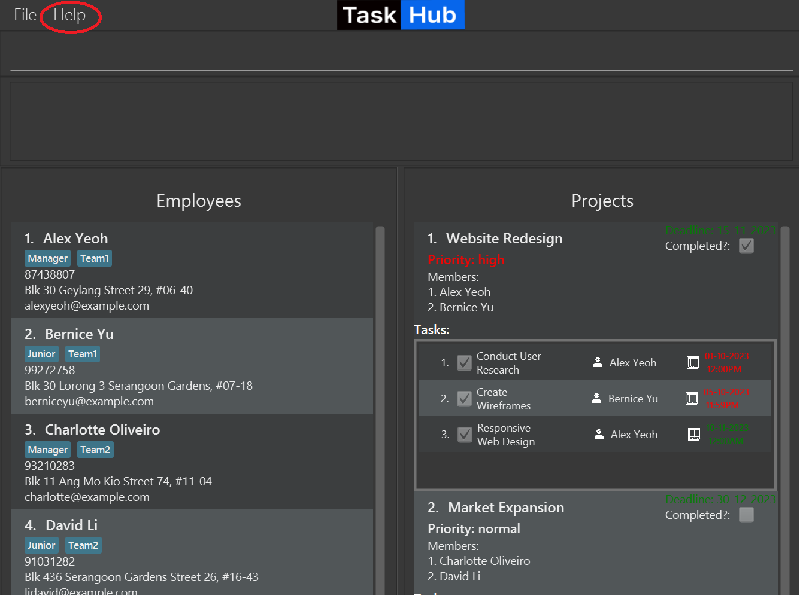
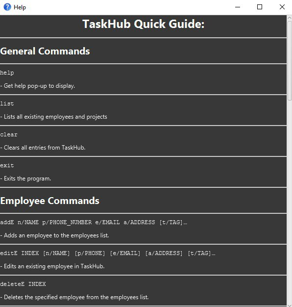
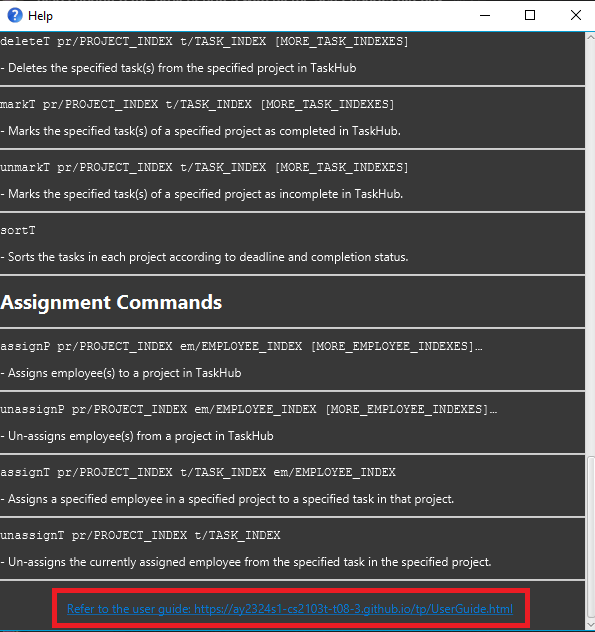
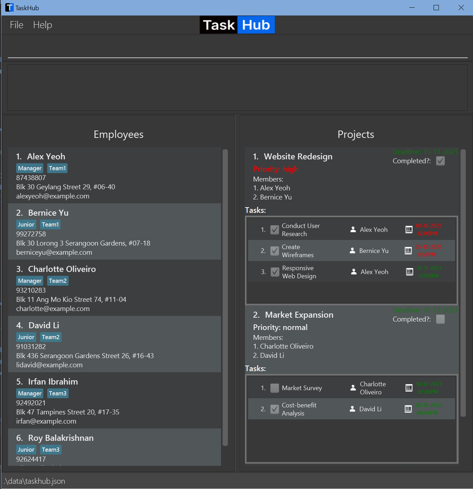
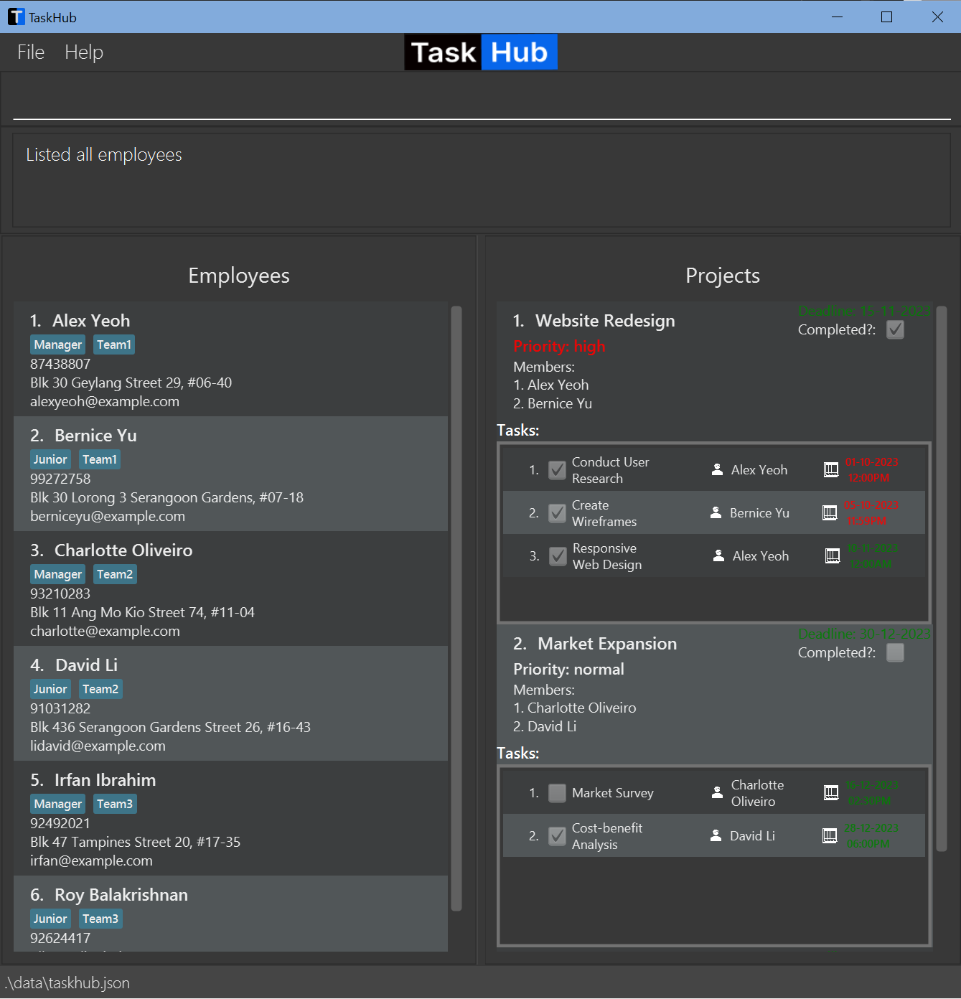
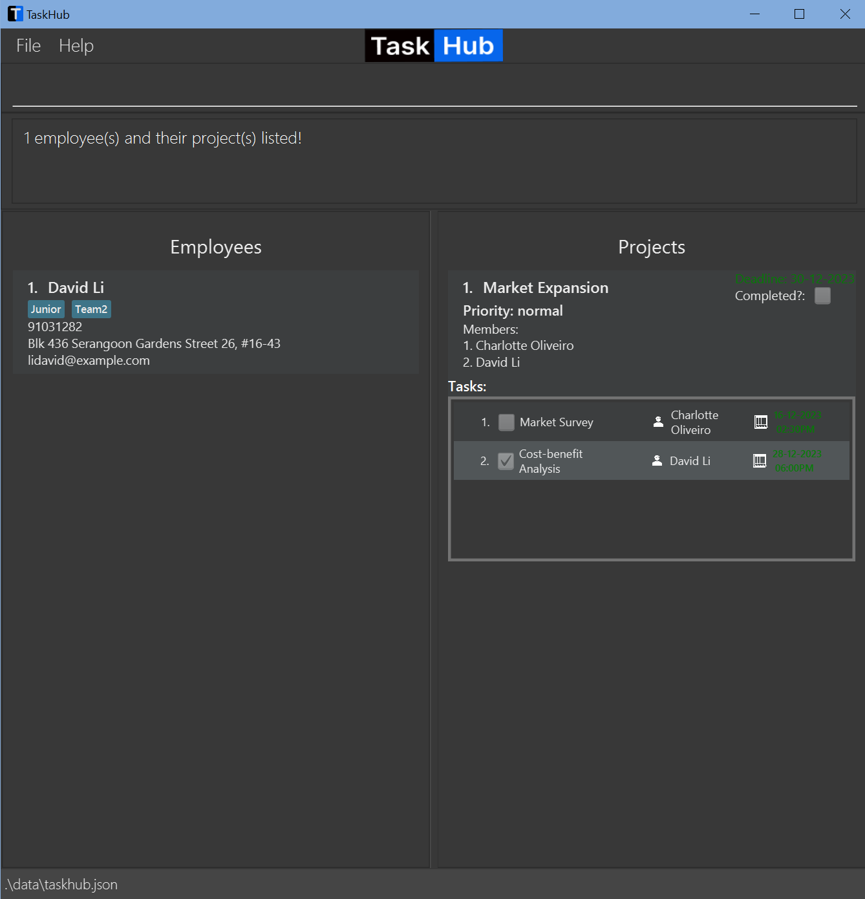
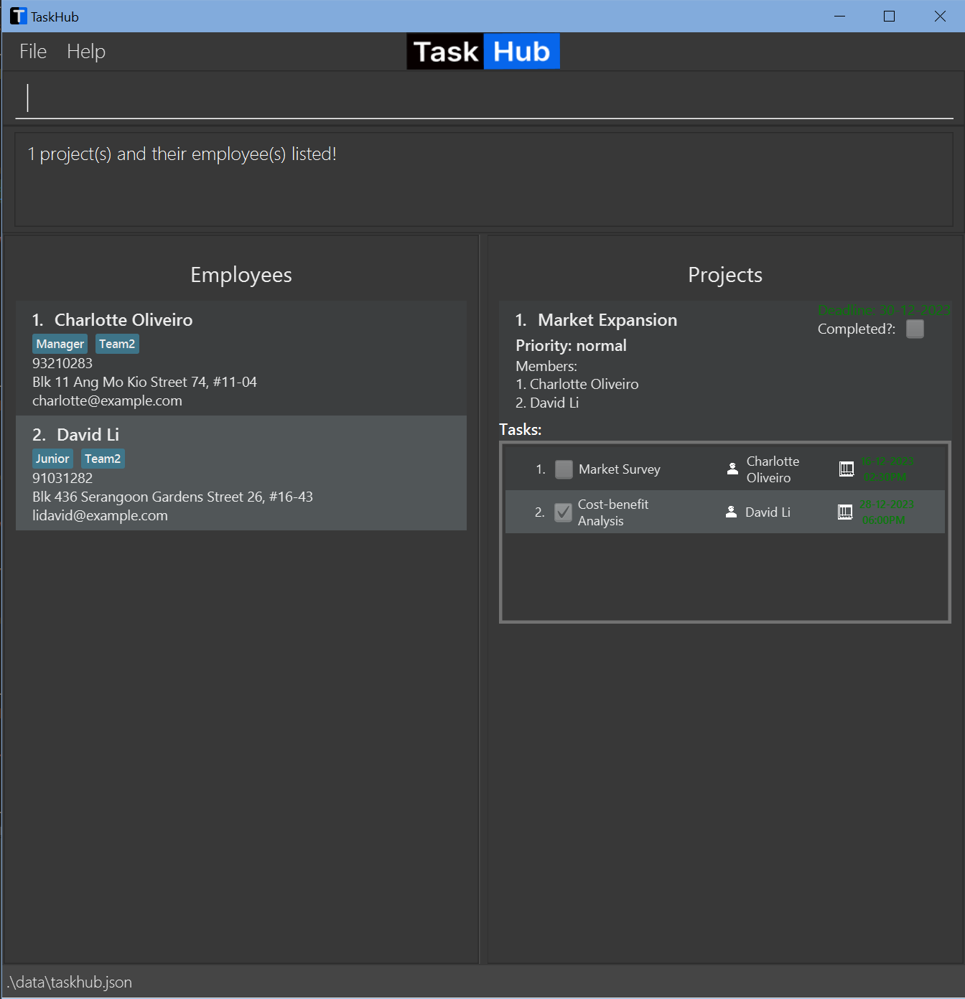
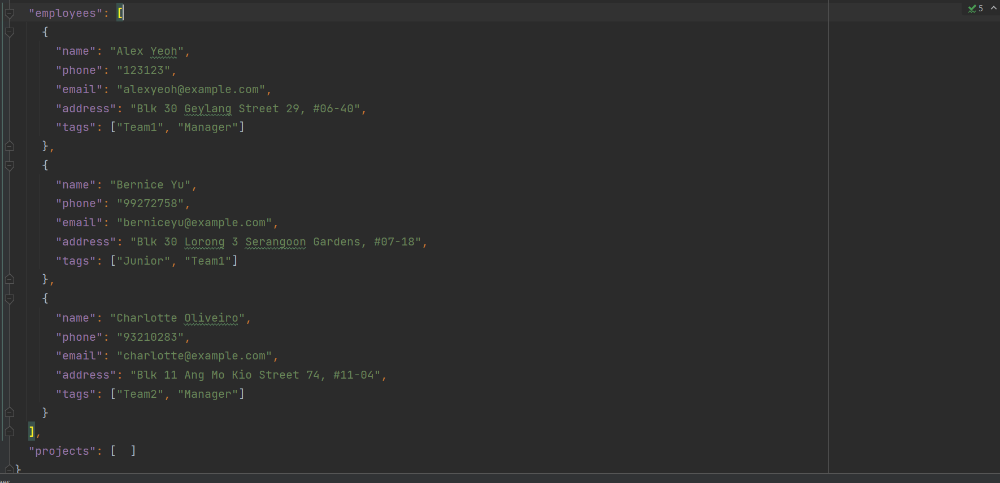
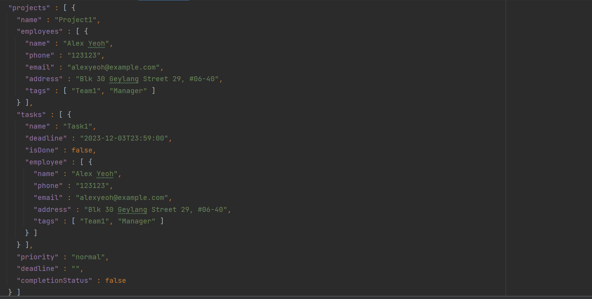

# Table of Contents
<!-- TOC -->
* [Introduction](#introduction)
  * [About TaskHub](#about-taskhub)
  * [About this User Guide](#about-this-user-guide)
  * [Navigating the User Guide](#navigating-the-user-guide)
* [Getting Started](#getting-started)
  * [Installing and launching TaskHub](#installing-and-launching-taskhub)
  * [Understanding the components of TaskHub](#understanding-the-components-of-taskhub)
  * [Understanding the User Interface (UI)](#understanding-the-user-interface--ui-)
  * [Quick start](#quick-start)
* [Features](#features)
  * [General Commands](#general-commands)
    * [View help: `help`](#view-help--help)
    * [List all employees and projects: `list`](#list-all-employees-and-projects--list)
    * [Clear all entries: `clear`](#clear-all-entries--clear)
    * [Exit the program: `exit`](#exit-the-program--exit)
  * [Employee Commands](#employee-commands)
    * [Add an employee: `addE`](#add-an-employee--adde)
    * [Edit an employee: `editE`](#edit-an-employee--edite)
    * [Delete an employee: `deleteE`](#delete-an-employee--deletee)
    * [List all employees: `listE`](#list-all-employees--liste)
    * [Locate employees by name: `findE`](#locate-employees-by-name--finde)
  * [Project Commands](#project-commands)
    * [Add a new project: `addP`](#add-a-new-project--addp)
    * [Edit a project: `editP`](#edit-a-project--editp)
    * [Delete a project: `deleteP`](#delete-a-project--deletep)
    * [Mark project(s) as completed: `markP`](#mark-project--s--as-completed--markp)
    * [Mark project(s) as incomplete: `unmarkP`](#mark-project--s--as-incomplete--unmarkp)
    * [Edit deadline of (a) project(s): `dlP`](#edit-deadline-of--a--project--s---dlp)
    * [Prioritise projects: `priorityP`](#prioritise-projects--priorityp)
    * [List all projects: `listP`](#list-all-projects--listp)
    * [Locate projects by name: `findP`](#locate-projects-by-name--findp)
  * [Task Commands](#task-commands)
    * [Add a new task to a project: `addT`](#add-a-new-task-to-a-project--addt)
    * [Delete a task from a project: `deleteT`](#delete-a-task-from-a-project--deletet)
    * [Mark task(s) as completed: `markT`](#mark-task--s--as-completed--markt)
    * [Mark task(s) as incomplete: `unmarkT`](#mark-task--s--as-incomplete--unmarkt)
    * [Sort tasks by deadline and completion status: `sortT`](#sort-tasks-by-deadline-and-completion-status--sortt)
  * [Assignment Commands](#assignment-commands)
    * [Assign employee(s) to a project: `assignP`](#assign-employee--s--to-a-project--assignp)
    * [Un-assign employee(s) from a project: `unassignP`](#un-assign-employee--s--from-a-project--unassignp)
    * [Assign an employee to a task: `assignT`](#assign-an-employee-to-a-task--assignt)
    * [Un-assign an employee from a task: `unassignT`](#un-assign-an-employee-from-a-task--unassignt)
  * [Data Storage](#data-storage)
    * [Save the data](#save-the-data)
    * [Edit the data file](#edit-the-data-file)
* [FAQ](#faq)
* [Known issues](#known-issues)
* [Command summary](#command-summary)
<!-- TOC -->

--------------------------------------------------------------------------------------------------------------------

# Introduction

## About TaskHub
Welcome to **TaskHub**, a powerful desktop application designed to make **project management** efficient and effortless.

With TaskHub, you will be able to:
* Store your employees' **contact information**
* Create and manage **projects** for your employees to be delegated to
* Create customized **tasks** for each project and assign your employees to them
* View all of your **employees, projects and tasks** at a glance

and much more!

TaskHub uses a **Command Line Interface (CLI)** for you to type in your desired **actions**. If you are a **fast typist**, this is perfect for you as it allows you to execute commands without having to leave the keyboard and gets your project management tasks done faster than traditional GUI apps.

TaskHub also uses a **Graphical User Interface (GUI)** to display **content and data**. This allows for data to be presented to you in an **elegant, fuss-free** manner.

Start to streamline your project management workflow today with TaskHub!

[Return to Table of Contents](#table-of-contents)

## About this User Guide

This user guide aims to provide you with all the information needed to get started with TaskHub.

If you are **new** to TaskHub, you may refer to the **[Navigating the User Guide](#navigating-the-user-guide)** section first, then to the **[Getting Started](#getting-started)** section to start installing and using TaskHub.

If you would like to find out more about its **individual features**, you may refer to the **[Features](#features)** section.

If you are an **experienced user** and want to quickly refer to the various commands, you may refer to the **[Command Summary](#command-summary)** section.

If you would like to find out more about the **technical aspects of TaskHub**, you may refer to our **[Developer Guide](https://ay2324s1-cs2103t-t08-3.github.io/tp/DeveloperGuide.html)**.

Finally, if you would like an **overview** of this entire user guide, you may refer to our **[Table of Contents](#table-of-contents)**.

[Return to Table of Contents](#table-of-contents)

## Navigating the User Guide

The following symbols will be used throughout this user guide to assist you.

**:bulb: Tip:** Provides information that is not necessary to know, but could **enhance** your **user experience**. 

**:information_source: Information:** Provides information that will be **useful to know**. 

**:warning: Warning:** Provides **important** information about a feature/command. 

**:no_entry: Danger:** Provides **very important** information about a consequence (that could be **irreversible**) from a feature/command. 

Links:
* Words in blue are [links](#navigating-the-user-guide) that direct you to either a [section](#navigating-the-user-guide) of our user guide, or [another website](https://ay2324s1-cs2103t-t08-3.github.io/tp/).
* At the bottom of every main section, there will be a [Return to Table of Contents](#table-of-contents) link directing you to the Table of Contents, allowing you to quickly switch between different sections.

[Return to Table of Contents](#table-of-contents)

--------------------------------------------------------------------------------------------------------------------

# Getting Started

## Installing and launching TaskHub

## Understanding the components of TaskHub

## Understanding the User Interface (UI)

TaskHub's UI consists of 4 main parts that you will be using for your project management:

### Menu Bar
* The menu bar is where you can exit TaskHub or even open the help window with a simple click of your mouse!
* While commands to exit TaskHub or open the help window can be entered as a command, this is a beginner-friendly alternative for newer users who might not be so familiar with the commands.

#### Help:
Upon clicking help on the menu bar as shown below,

a help window pops up with a list of all the possible commands:

and at the bottom of the window, is a link to our user guide.

### Command Panel
* The command panel is the main panel that you will be interacting with to key in commands and also get back the results of those commands.
* The upper box is where you can type in your command.
* And the lower box is where you will see the results of those commands.

### Employee Panel
* The employee panel is one of two panels that you can use to see what is stored in TaskHub.
* The employee panel, as the name suggests, is where all the information about each employee is stored.
* You can see their name, phone number, address, email address, and even whatever tags that you have for each of them as needed!

### Project Panel
* The project panel is the other panel that you will be using to see the data stored in TaskHub.
* Projects, as well as their members, tasks to complete in the project, and other important details for managing your project are stored here!

## Quick start

1. Ensure you have Java `11` or above installed in your Computer.

2. Download the latest `taskhub.jar` from [here](https://github.com/AY2324S1-CS2103T-T08-3/tp/releases).

3. Copy the file to the folder you want to use as the _home folder_ for your TaskHub.

4. Open a command terminal, `cd` into the folder you put the jar file in, and use the `java -jar taskhub.jar` command to run the application. 
   A GUI similar to the below should appear in a few seconds. Note how the app contains some sample data. 
   

5. Type the command in the command box and press Enter to execute it. e.g. typing **`help`** and pressing Enter will open the help window. 
   Some example commands you can try:

   * `listE` : Lists all employees.

   * `addE n/John Doe p/98765432 e/johnd@example.com a/John street, block 123, #01-01` : Adds an employee named `John Doe` to the TaskHub.

   * `deleteE 3` : Deletes the 3rd employee shown in the current list.

   * `clear` : Deletes all data.

   * `exit` : Exits the app.

6. Refer to the [Features](#features) below for details of each command.

--------------------------------------------------------------------------------------------------------------------

# Features

**:information_source: Notes about the command format:** 

* Words in `UPPER_CASE` are the parameters to be supplied by the user. 
  e.g. in `addE n/NAME`, `NAME` is a parameter which can be used as `addE n/John Doe`.

* Items in square brackets are optional. 
  e.g. `n/NAME [t/TAG]` can be used as `n/John Doe t/friend` or as `n/John Doe`.

* Items with `…`​ after them can be used multiple times including zero times. 
  e.g. `[t/TAG]…​` can be used as ` ` (i.e. 0 times), `t/friend`, `t/friend t/family` etc.

* Parameters can be in any order. 
  e.g. if the command specifies `n/NAME p/PHONE_NUMBER`, `p/PHONE_NUMBER n/NAME` is also acceptable.

* All commands that can take in multiple index should have its indexes separated by **single** spaces. 
e.g. if the command specifies `INDEX [MORE_INDEXES]`, it should be entered as `1 2 3` instead of `1  2  3`.

* Extraneous parameters for commands that do not take in parameters (such as `help`, `list`, `listE`, `listP`, `exit` and `clear`) will be ignored. 
  e.g. if the command specifies `help 123`, it will be interpreted as `help`.

* Commands that contain `[MORE INDEXES]` are able to take in more than one index for the relevant parameter, separated by spaces. 
  e.g. `1`, `2 5 4`, `3 7`

* If you are using a PDF version of this document, be careful when copying and pasting commands that span multiple lines as space characters surrounding line-breaks may be omitted when copied over to the application.

 

## General Commands

### View help: `help`

Enter a `help` command into TaskHub to quickly display the same help window without having to click on help.

Format: `help`

### List all employees and projects: `list`

Shows a list of all employees and projects in TaskHub.

Format: `list`

### Clear all entries: `clear`

Clears all entries from TaskHub.

Format: `clear`

### Exit the program: `exit`

Exits the program.

Format: `exit`

 

## Employee Commands

### Add an employee: `addE`

Adds an employee to the employees list.

Format: `addE n/NAME p/PHONE_NUMBER e/EMAIL a/ADDRESS [t/TAG]…​`

:bulb: **Tip:**
An employee can have any number of tags (including 0)

Examples:
* `addE n/John Doe p/98765432 e/johnd@example.com a/John street, block 123, #01-01`
* `addE n/Betsy Crowe t/Junior e/betsycrowe@example.com a/Brick street p/91234567 t/Employee`

### Edit an employee: `editE`

Edits an existing employee in the TaskHub.

Format: `editE INDEX [n/NAME] [p/PHONE] [e/EMAIL] [a/ADDRESS] [t/TAG]…​`

* Edits the employee at the specified `INDEX`. The index refers to the index number shown in the displayed employee list. The index **must be a positive integer** 1, 2, 3, …​
* At least one of the optional fields must be provided.
* Existing values will be updated to the input values.
* When editing tags, the existing tags of the employee will be removed i.e. adding of tags is not cumulative.
* You can remove all the employee’s tags by typing `t/` without
  specifying any tags after it.

Examples:
*  `editE 1 p/91234567 e/johndoe@example.com` Edits the phone number and email address of the 1st employee to be `91234567` and `johndoe@example.com` respectively.
*  `editE 2 n/Betsy Crower t/` Edits the name of the 2nd employee to be `Betsy Crower` and clears all existing tags.

### Delete an employee: `deleteE`

Deletes the specified employee from the employees list.

Format: `deleteE INDEX`

* Deletes the employee at the specified `INDEX`.
* The index refers to the index number shown in the displayed employees list.
* The index **must be a positive integer** 1, 2, 3, …​

Examples:
* `listE` followed by `deleteE 2` deletes the 2nd employee in the employees list.
* `findE Betsy` followed by `deleteE 1` deletes the 1st employee in the results of the `findE` command.

### List all employees: `listE`

Shows a list of all employees in TaskHub.

Format: `listE`

### Locate employees by name: `findE`

Finds employees whose names contain any of the given keywords.
Additionally, it shows only the projects that these employees are under.

Format: `findE KEYWORD [MORE_KEYWORDS]`

* The search is case-insensitive. e.g. `hans` will match `Hans`
* The order of the keywords does not matter. e.g. `Hans Bo` will match `Bo Hans`
* Only the name is searched.
* Only full words will be matched e.g. `Han` will not match `Hans`
* Employees matching at least one keyword will be returned (i.e. `OR` search).
  e.g. `Hans Bo` will return `Hans Gruber`, `Bo Yang`

Examples:
* `findE John` returns `john` and `John Doe`
* `findE alex david` returns `Alex Yeoh`, `David Li`
* `findE david` returns `David Li`   

  

 

## Project Commands

### Add a new project: `addP`

Adds a new project in TaskHub

Format: `addP n/PROJECT_NAME [em/EMPLOYEE_INDEXES] ...`

* Adds a new project with the employees assigned to the project.
* Each employee index __must be separated with a space.__
* The employee must exist in the employees list.
* There is no deadline by default.
* The priority is `normal` by default.
* The status is `not completed` by default.

Examples: 
* `addP n/Project1 em/1` will add `Project1` to the projects list with the employee index 1 assigned to the project.
* `addP n/Project2` will add an empty `Project2` to the projects list.

### Edit a project: `editP`

Edits an existing project in the TaskHub.

Format: `editP INDEX [n/NAME] [p/PRIORITY] [d/DEADLINE]`

* Edits the project at the specified `INDEX`. The index refers to the index number shown in the displayed project list. The index must be a positive integer 1, 2, 3, …​
* At least one of the optional fields must be provided.
* Existing values will be updated to the input values.
* If a `DEADLINE` date is provided, it must be in the `dd-MM-yyyy` format.
* You can remove the `DEADLINE` of the project by typing `d/` without specifying any deadline after it.
* You can also provide a `DEADLINE` date e.g. `d/01-01-2024`, in which case the provided deadline will overwrite the current deadline (if any).

Examples:
* `editP 1 n/Market Analysis p/low` Edits the name and priority of the 1st project to `Market Analysis` and `low` respectively.
* `editP 2 p/high d/` Edits the priority and deadline of the 2nd project to `high` and removes the deadline.

### Delete a project: `deleteP`

Deletes the specified project from TaskHub.

Format: `deleteP INDEX`
* Deletes the project at the specified `INDEX`.
* The index refers to the index number shown in the displayed employees list.
* The index __must be a positive integer__ 1, 2, 3,...

Examples:
* `listP` followed by `deleteP 2` deletes the 2nd project in TaskHub.

### Mark project(s) as completed: `markP`

Marks the specified project(s) as completed in TaskHub.

Format `markP INDEX [MORE_INDEXES]`

* Marks the project(s) at the specified `INDEX(ES)` as completed.
* The index(es) refers to the index number shown in the displayed projects list.
* The index(es) **must be a positive integers** 1, 2, 3,...

Examples:
* `listP` followed by `markP 1 3` marks the 1st and 3rd projects as completed in TaskHub.
* `findP Capstone` followed by `markP 1` marks the 1st project in the results of the `findP` command as completed.

### Mark project(s) as incomplete: `unmarkP`

Marks the specified project(s) as incomplete in TaskHub.

Format `unmarkP INDEX [MORE_INDEXES]`

* Marks the project(s) at the specified `INDEX(ES)` as incomplete.
* The index(es) refers to the index number shown in the displayed projects list.
* The index(es) **must be a positive integers** 1, 2, 3,...

Examples:
* `listP` followed by `unmarkP 1 3` marks the 1st and 3rd projects as incomplete in TaskHub.
* `findP Capstone` followed by `unmarkP 1` marks the 1st project in the results of the `findP` command as incomplete.

### Edit deadline of (a) project(s): `dlP`

Edits the deadline of the specified project(s) in the projects list.

Format: `dlP INDEX [MORE_INDEXES] d/[DEADLINE]`

* Edits the deadline of the project(s) at the specified `INDEX(ES)`.
* The index(es) refers to the index number shown in the displayed projects list.
* The index(es) **must be a positive integer** 1, 2, 3, …
* DATE refers to the date of the deadline.
* The `d/` prefix is required, but the `DEADLINE` is optional.
* If a date is provided, it must be in the `dd-MM-yyyy` format.
* Existing deadline will be updated to the new deadline.
* To remove the deadline of a project, leave the `DEADLINE` blank.

Examples:
*  `dlP 2 d/18-01-2022` sets the deadline of the 2nd project to be `18-01-2022`.
*  `dlP 1 2 d/` removes the deadline of the 1st and 2nd projects.
*  `findP Infinity` followed by `dlP 1 d/25-11-2024` sets the deadline of the 1st project in the results of the `findP` command to be `25-11-2024`.

### Prioritise projects: `priorityP`

Sets a priority for the specified project(s) in TaskHub.

Format: `priorityP INDEX [MORE_INDEXES] p/PRIORITY`
* Sets the priority of the project(s) at the specified `INDEX(ES)`.
* The index refers to the index number shown in the displayed projects list.
* The index __must be a positive integer__ 1, 2, 3,...
* All projects are set to normal priority by default.

**:warning: Warning** 

The `PRIORITY` must be one of the following: `low`, `normal`, `high`.

Examples:
* `listP` followed by `priorityP 1 2 p/high` sets the 1st and 2nd projects as high priority in TaskHub.

### List all projects: `listP`

Shows a list of all projects in TaskHub.

Format: `listP`

### Locate projects by name: `findP`

Find projects whose names contain any of the given keywords.
Additionally, it shows only the employees that are under these projects.

Format: `findP KEYWORD [MORE_KEYWORDS]`

* The search is case-insensitive. e.g. `website` will match `Website`
* The order of the keywords does not matter. e.g. `Create Website` will match `Website Create`
* Only the name is searched.
* Only full words will be matched e.g. `Website` will not match `Websites`
* Projects matching at least one keyword will be returned (i.e. `OR` search).
  e.g. `Website Model` will return `Create Website`, `Build Model`

Examples:
* `findP website model` returns `Create Website`, `Build Model`
* `findP market` returns `Market Expansion`  
  

 

## Task Commands

### Add a new task to a project: `addT`

Adds a new task to the specified project in TaskHub and assigns it to the (optionally) specified employee.

Format `addT pr/PROJECT_INDEX [em/EMPLOYEE_INDEX] n/TASK_NAME d/DEADLINE(dd-MM-yyyy HHmm) `

* Adds a new task to the project at the specified `PROJECT_INDEX`.
* The employee index field is optional - the task will be assigned to the employee at `EMPLOYEE_INDEX` if specified,
* otherwise it will have no assignee, and `assignT` can be used after that to assign it to an employee.
* The index(es) **must be positive integers** 1, 2, 3,...
* The deadline must be in the format `dd-MM-yyyy HHmm`. For example, `11-10-2023 2359` refers to 11th October 2023, 11.59pm.
* It is possible for the deadline of the task to be after the deadline of the project. There are currently no warnings for such an input so please be careful while inputting your deadline dates.

Examples:
* `listP` followed by `addT pr/1 n/Website d/11-10-2023 2359` adds a task named `Website` with deadline `11-10-2023 2359` to the 1st project.
* `findP Capstone` followed by `addT pr/1 n/Website d/11-10-2023 2359` adds a task named `Website` with deadline `11-10-2023 2359` to the 1st project from the result of the `findP` command.

### Delete a task from a project: `deleteT`

Deletes the specified task(s) from the specified project in TaskHub

Format `deleteT pr/PROJECT_INDEX t/TASK_INDEX [MORE_TASK_INDEXES]`

* Deletes the tasks at the specified `TASK_INDEX`(es), from the project at the specified `PROJECT_INDEX`.
* The project index refers to the index number shown in the displayed projects list.
* The task index(es) refer to the index number(s) shown in the task list of the above specified project.
* The index(es) **must be positive integers** 1, 2, 3,...

Examples:
* `listP` followed by `deleteT pr/1 t/1 3` deletes the 1st and 3rd tasks of the 1st project from TaskHub.
* `findP Capstone` followed by `deleteT pr/2 t/2` deletes the 2nd task in the 2nd project from the results of the `findP` command.

### Mark task(s) as completed: `markT`

Marks the specified task(s) of a specified project as completed in TaskHub.

Format `markT pr/PROJECT_INDEX t/TASK_INDEX [MORE_TASK_INDEXES]`

* Marks the tasks(s) at the specified `TASK_INDEX`(es), of the project at the specified `PROJECT_INDEX` as completed.
* The project index refers to the index number shown in the displayed projects list.
* The task index(es) refer to the index number(s) shown in the task list of the above specified project.
* The index(es) **must be positive integers** 1, 2, 3,...

Examples:
* `listP` followed by `markT pr/1 t/1 3` marks the 1st and 3rd tasks of the 1st project as completed in TaskHub.
* `findP Capstone` followed by `markT pr/2 t/2` marks the 2nd task in the 2nd project from the results of the `findP` command as completed.

### Mark task(s) as incomplete: `unmarkT`

Marks the specified task(s) of a specified project as incomplete in TaskHub.

Format `unmarkT pr/PROJECT_INDEX t/TASK_INDEX [MORE_TASK_INDEXES]`

* Marks the tasks(s) at the specified `TASK_INDEX`(es), of the project at the specified `PROJECT_INDEX` as incomplete.
* The project index refers to the index number shown in the displayed projects list.
* The task index(es) refer to the index number(s) shown in the task list of the above specified project.
* The index(es) **must be positive integers** 1, 2, 3,...

Examples:
* `listP` followed by `unmarkT pr/1 t/1 3` marks the 1st and 3rd tasks of the 1st project as incomplete in TaskHub.
* `findP Capstone` followed by `unmarkT pr/2 t/2` marks the 2nd task in the 2nd project from the results of the `findP` command as incomplete.

### Sort tasks by deadline and completion status: `sortT`

Sorts the tasks in each project by their deadline and completion status.

Format: `sortT`

* The sorting of tasks is done within each project i.e. tasks from different projects are not compared.
* Incomplete tasks will be placed before completed ones and tasks with an earlier deadline will be placed before those with a later one.
* Completion status takes precedence over deadline i.e. an incomplete task with a later deadline will be placed before a completed task with an earlier deadline.

 

## Assignment Commands

### Assign employee(s) to a project: `assignP`

Assigns employee(s) to a project in TaskHub

Format: `assignP pr/PROJECT_INDEX em/EMPLOYEE_INDEX [MORE_EMPLOYEE_INDEXES] ...`
* The employee(s) will be assigned to the project
* Each employee index __must be separated with a space.__
* The project and employee index refers to the index number shown in the displayed project and employee list.

Examples:
* `list` followed by `assignP pr/2 em/1 3` will assign the 1st and 3rd employees to the 2nd project.
* `findP Capstone` followed by `assignP pr/1 em/1` will assign the 1st employee to the 1st project from the results of the `findP` command.

### Un-assign employee(s) from a project: `unassignP`

Un-assigns employee(s) from a project in TaskHub

Format: `unassignP pr/PROJECT_INDEX em/EMPLOYEE_INDEX [MORE_EMPLOYEE_INDEXES] ...`

* The employee(s) will be unassigned from the project
* Each employee index __must be separated with a space.__
* The project and employee index refers to the index number shown in the displayed project and employee list.
* If the employee is assigned to a task within the project, the employee will be unassigned from the task as well.

Examples:
* `list` followed by `unassignP pr/2 em/1 3` will un-assign the 1st and 3rd employees from the 2nd project.
* `findP Capstone` followed by `unassignP pr/1 em/1` un-assigns the 1st employee from the 1st project from the results of the `findP` command.

### Assign an employee to a task: `assignT`

Assigns a specified employee in a specified project to a specified task in that project.

Format `assignT pr/PROJECT_INDEX t/TASK_INDEX em/EMPLOYEE_INDEX`

* The project index refers to the index number shown in the displayed projects list.
* The task index refers to the index number shown in the last list of the above specified project.
* The employee index refers to the index number of the employee **in the project list**.
* The index(es) **must be positive integers** 1, 2, 3,...

**:warning: Warning** 

* In this version of TaskHub, only a single employee can be assigned to a task at a time.
* Assigning a task that has already been assigned to another employee will overwrite that employee.

Examples:
* `listP` followed by `assignT pr/1 t/1 em/2` assigns the first task in the first project to the second employee in the project.
* `findP Capstone` followed by `assignT pr/2 t/2 em/2` assigns the second task, in the second project from the results of `findP`, to the second employee in the project.

### Un-assign an employee from a task: `unassignT`

Un-assigns the currently assigned employee from the specified task in the specified project.

Format `unassignT pr/PROJECT_INDEX t/TASK_INDEX`

* The project index refers to the index number shown in the displayed projects list.
* The task index refers to the index number shown in the last list of the above specified project.
* The index(es) **must be positive integers** 1, 2, 3,...

Examples:
* `listP` followed by `unassignT pr/1 t/1` un-assigns the first task in the first project from the currently assigned employee.
* `findP Capstone` followed by `unassignT pr/2 t/2` un-assigns the second task, in the second project from the results of `findP`, from the currently assigned employee.

 

## Data Storage

### Save the data

TaskHub's data is saved in the hard disk automatically after any command that changes the data. There is no need to save manually.

### Edit the data file

TaskHub data are saved automatically as a JSON file `[JAR file location]/data/taskhub.json`. Advanced users are welcome to update data directly by editing that data file.

:exclamation: **Caution:**
If your changes to the data file makes its format invalid, TaskHub will discard all data and start with an empty data file at the next run. Hence, it is recommended to take a backup of the file before editing it.

--------------------------------------------------------------------------------------------------------------------

# FAQ

**Q**: Why is all my TaskHub data gone? 
**A**: Most likely, your data is still mostly intact, so it is recommended to exit the app first by manually closing the window or the shortcut `Alt + F4` as executing some commands such as `addE`,`exit` and `clear` will clear the previously stored data in this situation.
Taskhub may appear empty as it requires all data stored in the data file to be in the correct format so that it can be read back to TaskHub. A TaskHub that suddenly becomes empty indicates an issue with the data file. 

:information_source:
**The solution below assumes that you are familiar with files in the `.json` format, and how TaskHub stores data. If you are unfamiliar, please check out **[this website](https://www.w3schools.com/js/js_json_intro.asp)** to know more about `.json` files**  
If you have directly changed any data in the `taskhub.json` file instead of through TaskHub, it is highly likely that it would be in the wrong format, resulting in an empty TaskHub. 
To attempt to recover as much data as possible, it is recommended to save a copy of the `taskhub.json` file somewhere else and perform the following actions: 
* Remove all projects from your `taskhub.json` file. (`"projects" : []` should be the result after this operation, like the image shown below) 

* Run TaskHub with the edited `taskhub.json` file. If the list of employees is shown, then the problem lies in your projects. Otherwise, a format error lies in the `"employee"` section of your json file. 
It is recommended to start from scratch because most likely your projects and tasks that involve the employee have different degree of changes, and it might be impractical to manually change each occurence of the employee.  
* Now, add each project one by one, ensuring that TaskHub can run normally after each project addition. If TaskHub appears empty after the addition of a particular project, it is most likely that the employees in the project are different from those stored in TaskHub.
Check the employees assigned in your project and employees assigned to relevant tasks, making sure every field is equal to its counterpart in the employee list. 
While checking an employee assigned to a task, make sure the employee is the same employee in the project and in the employee list. Each project should have this format:

* Repeat the step above until every project is added to TaskHub.
If you have not changed anything, ensure your `data` folder containing your `taskhub.json` is in the same folder as your `taskhub.jar`. 

**Q**: Why is TaskHub not loading for me? 
**A**: If you did modify your `taskhub.json` file, it is most likely that you put the keyword `null` somewhere in the json file. Removing these keywords should at least present to you an empty TaskHub. 
Another possibility is that your `taskhub.log` or `taskhub.json` files are set to read-only. 
The first step is to open the folder that contains all your files related to TaskHub.
* For Windows users, right-click each file in your file explorer, click on properties and untick `Read-only` in `Attributes`. 
* For MacOS users, for each file in Finder choose `File` > `Get Info` > `Sharing & Permissions`. Set the privilege for yourself to be `Read & Write`. 
* For Linux users, run `chmod a+rw *` in your terminal. If you have difficulty navigating to your directory that contains the files, check out the "Navigation and Exploration" section of [this website](https://www.digitalocean.com/community/tutorials/basic-linux-navigation-and-file-management).  

**Q**: How do I transfer my data to another Computer? 
**A**: Install the app in the other computer and overwrite the empty data file it creates with the file that contains the data of your previous TaskHub home folder.

--------------------------------------------------------------------------------------------------------------------

# Known issues

1. **When using multiple screens**, if you move the application to a secondary screen, and later switch to using only the primary screen, the GUI will open off-screen. The remedy is to delete the `preferences.json` file created by the application before running the application again.

--------------------------------------------------------------------------------------------------------------------

# Command summary

## General Commands

| Action                                                                        | Format, Examples                                                                                                                                                                          |
|-------------------------------------------------------------------------------|-------------------------------------------------------------------------------------------------------------------------------------------------------------------------------------------|
| [**Help**](#view-help--help)                                                  | `help`                                                                                                                                                                                    |
| [**List All Employees And Projects**](#list-all-employees-and-projects--list) | `list`                                                                                                                                                                                    |
| [**Clear**](#clear-all-entries--clear)                                        | `clear`                                                                                                                                                                                   |
| [**Exit**](#exit-the-program--exit)                                           | `exit`                                                                                                                                                                                    |

## Employee Commands

| Action                                                   | Format, Examples                                                                                                                                                              |
|----------------------------------------------------------|-------------------------------------------------------------------------------------------------------------------------------------------------------------------------------|
| [**Add Employee**](#add-an-employee--adde)               | `addE n/NAME p/PHONE_NUMBER e/EMAIL a/ADDRESS [t/TAG]…​`   e.g., `addE n/James Ho p/22224444 e/jamesho@example.com a/123, Clementi Rd, 1234665 t/Java`                     |
| [**Edit Employee**](#edit-an-employee--edite)            | `editE INDEX [n/NAME] [p/PHONE_NUMBER] [e/EMAIL] [a/ADDRESS] [t/TAG]…​`   e.g., `editE 1 n/John Doe p/11114444 e/johndoe@example.com a/123, Clementi Rd, 1234665 t/Python` |
| [**Delete Employee**](#delete-an-employee--deletee)      | `deleteE INDEX`  e.g., `deleteE 3`                                                                                                                                         |
| [**List All Employees**](#list-all-employees--liste)     | `listE`                                                                                                                                                                       |
| [**Find Employee(s)**](#locate-employees-by-name--finde) | `findE KEYWORD [MORE_KEYWORDS]`  e.g., `findE James Jake`                                                                                                                  |

## Project Commands

| Action                                                                        | Format, Examples                                                                              |
|-------------------------------------------------------------------------------|-----------------------------------------------------------------------------------------------|
| [**Add Project**](#add-a-new-project--addp)                                   | `addP n/PROJECT_NAME [em/EMPLOYEE_INDEX]…​`   e.g, `addP n/CS2103T em/2 3 4 5`             |
| [**Edit Project**](#edit-a-project--editp)                                    | `editP INDEX [n/NAME] [p/PRIORITY] [d/DEADLINE]`   e.g., `editP 3 n/Create Website p/high` |
| [**Delete Project**](#delete-a-project--deletep)                              | `deleteP INDEX`  e.g., `deleteP 3`                                                         |
| [**Mark Project(s) As Complete**](#mark-project--s--as-completed--markp)      | `markP INDEX [MORE_INDEXES]`  e.g., `markP 1 3`                                            |
| [**Mark Project(s) As Incomplete**](#mark-project--s--as-incomplete--unmarkp) | `unmarkP INDEX [MORE_INDEXES]`  e.g., `unmarkP 1 3`                                        |
| [**Edit Project Deadline**](#edit-deadline-of--a--project--s---dlp)           | `dlP INDEX [MORE_INDEXES] d/[DEADLINE]`   e.g., `dlP 1 2 d/27-11-2023`                  |
| [**Prioritise Project(s)**](#prioritise-projects--priorityp)                  | `priorityP INDEX [MORE_INDEXES] p/PRIORITY`   e.g., `priorityP 1 2 p/high`              |
| [**List All Projects**](#list-all-projects--listp)                            | `listP`                                                                                       |
| [**Find Project(s)**](#locate-projects-by-name--findp)                        | `findP KEYWORD [MORE_KEYWORDS]`  e.g., `findP Website Create`                              |

## Task Commands

| Action                                                                                                    | Format, Examples                                                                                                                                                                          |
|-----------------------------------------------------------------------------------------------------------|-------------------------------------------------------------------------------------------------------------------------------------------------------------------------------------------|
| [**Add Task**](#add-a-new-task-to-a-project--addt)                                                        | `addT pr/PROJECT_INDEX [em/EMPLOYEE_INDEX] n/TASK_NAME d/DEADLINE(dd-MM-yyyy HHmm)`  e.g., `addT pr/1 em/1 n/Read docs d/11-11-2023 2359`                                              |
| [**Delete Task**](#delete-a-task-from-a-project--deletet)                                                 | `deleteT pr/PROJECT_INDEX t/TASK_INDEX [MORE_TASK_INDEXES]`   e.g., `deleteT pr/1 t/1 5 3`                                                                                             |
| [**Mark Task(s) As Complete**](#mark-task--s--as-completed--markt)                                        | `markT pr/PROJECT_INDEX t/TASK_INDEX [MORE_TASK_INDEXES]`  e.g., `markT pr/1 t/1 3`                                                                                                    |
| [**Mark Task(s) As Incomplete**](#mark-task--s--as-incomplete--unmarkt)                                   | `unmarkT pr/PROJECT_INDEX t/TASK_INDEX [MORE_TASK_INDEXES]`  e.g., `unmarkT pr/1 t/1 3`                                                                                                |
| [**Sort Tasks By Deadline And Completion Status**](#sort-tasks-by-deadline-and-completion-status--sortt)  | `sortT`                                                                                                                                                                                   |

## Assignment Commands
| Action                                                                                      | Format, Examples                                                                                          |
|---------------------------------------------------------------------------------------------|-----------------------------------------------------------------------------------------------------------|
| [**Assign Employee(s) To Project**](#assign-employee--s--to-a-project--assignp)             | `assignP pr/PROJECT_INDEX em/EMPLOYEE_INDEX [MORE_EMPLOYEE_INDEXES]…​`   e.g, `assignP pr/4 em/1 2 3`  |
| [**Un-assign Employee(s) From Project**](#un-assign-employee--s--from-a-project--unassignp) | `unassignP pr/PROJECT_INDEX em/EMPLOYEE_INDEX [MORE_EMPLOYEE_INDEXES]`   e.g, `unassignP pr/2 em/1 3`  |
| [**Assign Employee to Task**](#assign-an-employee-to-a-task--assignt)                       | `assignT pr/PROJECT_INDEX t/TASK_INDEX em/EMPLOYEE_INDEX`   e.g., `assignT pr/1 t/1 em/3`              |
| [**Un-assign Employee from Task**](#un-assign-an-employee-from-a-task--unassignt)           | `unassignT pr/PROJECT_INDEX t/TASK_INDEX`   e.g., `unassignT pr/1 t/1`                                 |

[Return to Table of Contents](#table-of-contents)
